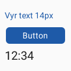
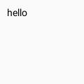
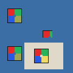
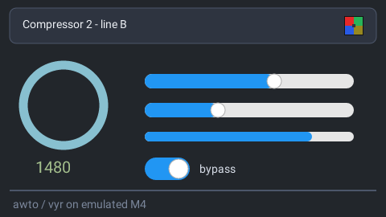
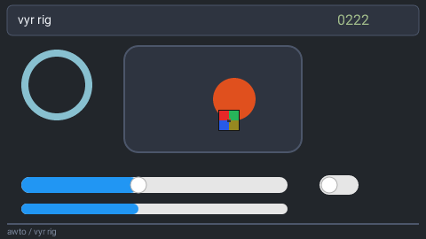
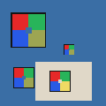
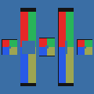
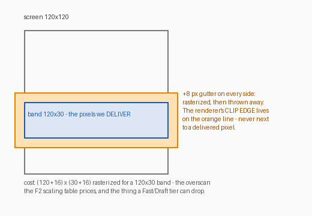
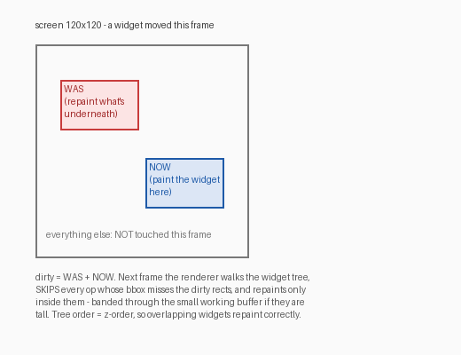

# vyr milestones — the renderer's own history, in its own pixels

Every feature track that changes what vyr can paint commits its evidence
render HERE, in the same commit (or the bump after). These are the **golden
pixels** where one exists (the PNG the committed hash pins), so this page is
the visual changelog of the executable spec. Posterity rule: rows are
APPENDED, never replaced — a later improvement gets a new row, the old pixels
stay as history.

Local gallery page: [`index.html`](index.html) (open via file:// or any
static server). On GitHub this README renders inline below.

| Stage | Date | Commit | Render | What it proves |
|---|---|---|---|---|
| **F1 — primitives** | 2026-06-11 | `b4f441a` |  | The polygon-only tiny-skia painter: rounded fill, stroked outline, alpha-blended disc, ring, diagonal rule, linear gradient. The exact bytes of `GOLDEN_FNV1A`; byte-identical when rendered as 30-row or 17-row stitched bands. |
| **F3-lite — IR widgets** | 2026-06-11 | `83a7c09` |  | The `vy_` vocabulary rendered natively from IR JSON (no lowering): bordered frame, disc, 60% slider + knob, toggle ON, gauge ring, rule. `IR_GOLDEN_FNV1A`; band-exact. |
| **F5 — text** | 2026-06-11 | `834ed5e` |  | skrifa-parsed Roboto through the rasterize-once A8 glyph cache: 14px label, button with centred ink-inherited label, 20px `vy_lcd`. `TEXT_GOLDEN_FNV1A`; band-exact (glyph curves never meet band clipping). Full path is `no_std` (thumbv7em). |
| **F7 — the farm speaks vyr** | 2026-06-11 | vyvanse `84a612d` / `2fac0e9` |    | The same widgets rendered THROUGH the vyvanse render farm (`render(thing, "vyr")` → vyr_server → one-shot vyr-cli), ~2 ms each — vyr live as the fifth backend beside Qt/LVGL/TGX/Flutter. |
| **F6 — images** | 2026-06-11 | `28ea911` |  | The committed 24×24 RGBA checker blitted from the caller-owned `Assets` registry (decode in cli, core blits — I7): natural size inside a bigger widget, CLIPPED by a smaller one, over a frame, via `vy_imagebutton`. The semi-transparent quadrant blends by exact integer source-over (spot-asserted to the byte); the transparent hole skips. `IMAGE_GOLDEN_FNV1A`; band-exact (integer blits — the glyph argument). |

| **F4 wave 1 — radio + checkbox** | 2026-06-11 | (see git) |  | Native `vy_radio`/`vy_checkbox` composites with the #313 mark geometry (ring `max(2,d/10)`, 44% dot, accent `#1E5AA8`) so vyr's native rendering agrees with the lowered composites the other backends draw; labels vertically centred via the measurement API. `STRUCTURE_GOLDEN_FNV1A`; band-exact. The last of the interactive vocabulary — what remains is long-tail placeholders + spec-driven refinement. |
| **F3 complete — clip stack + dirty rects** | 2026-06-11 | (see git) |  | Containers clip their children, radius-aware: the disc bites the rounded corner ARC, the checker pokes through the top-right arc and is trimmed along it, glyph runs cut mid-letter, a nested frame clips its rule (stack depth 2), and the lower container is the pure-rect integer-span fast path. The clip mask is built from the SAME quantized-world polygons as paint — `CLIP_GOLDEN_FNV1A`, band-exact (even + uneven splits); every pre-clip golden held byte-identical (children inside parents take the containment fast path — provably untouched bytes). And the retained-mode primitive landed with it: `dirty_rects(prev, next)` (WAS + NOW subtree bboxes, clip-context-tightened) + `render_incremental` — **proven by re-rendering ONLY the dirty regions onto the old frame and getting the full render's exact bytes** for moves, restyles, removals, additions and no-ops; also the first arbitrary-rect (vertical-seam) band-equivalence exercise. One toggle flip on a 480×320 panel: ~8× faster than the full frame, diff included. |
| **F9 phase 1 — vyr BOOTS on an emulated Cortex-M4** | 2026-06-12 | (see git) |  | This 480×270 panel (text via the 8,084 B ASCII-subset Roboto — 5.0% of the full face — image, widgets) was rendered as 480×16 horizontal bands by a REAL ARMv7-M boot under `qemu-system-arm -machine netduinoplus2` (STM32F405: 128 KiB SRAM + 64 KiB CCM — tighter than the F427 budget): hand-rolled vector table, crt0, FPU enable, counted first-fit heap, semihosting report. Frame FNV-1a `0x6b0c51567a991741` — **byte-identical to x86-64**, banded == full-frame. Heap peak 106,409 B (+23,040 B CCM band buffer ≈ 66% of an F427's SRAM); ~75 M insns/frame measured by deterministic icount virtual time (~417 ms/frame @180 MHz ESTIMATE at CPI=1 — full-redraw 60 fps is not the M4 story; dirty-rects + bands are). `./dev.py qemu-m4`; the cross-environment memory table: docs/measurements/f9-static.md. |
| **F18 — the rig: animation, ladder to 4K, cross-ISA** | 2026-06-11 | (see git) |  | Frame 222 of the 600-frame (10 s @ logical 60 fps) acceptance run: a frame-INDEX-driven parametric scene (no clocks — I2): slider sweeping every frame, toggle blinking at a 30-frame period, progress sawtooth, a disc crossing its container's rounded clip edges, a digits-only counter, the checker translating OVER the mover (z-order restack live). Every frame rendered BOTH ways — full, and incrementally via `dirty_rects`/`render_incremental` from the previous frame — **byte-identical on all 600 frames** (~14.6% of the screen dirty per step); per-frame FNV-1a hashes chain into the committed golden `vyr-rig/hashchain.json` (run hash `0x1e8a6c9f6822af7a`), so a lossless-video regression costs kilobytes (the FFV1 video itself is a `./tmp` artifact: `./dev.py anim`). **Cross-ISA:** the same binary cross-built static for ARMv7-musl and replayed under `qemu-arm-static` produced **byte-identical hashes on all 600 frames** — F1's last acceptance box ("byte-identical on two machines") closed across an entire ISA. The resolution ladder (120×68 → 3840×2160) joined the perf gates: see the numbers table below and the published [perf history](../perf/index.html). |
| **F8 Gate 1 — vyr IS the oracle** | 2026-06-12 | `cab0038` |  | The blocker that made vyr a real reference renderer: it now **blends partial alpha**. Three fade fixtures — blue `#2040E0` at α 64 / 128 / 192 over the white card — composite the analytic source-over (`round(fg·α + bg·(255−α))`), L-inf ≤4 vs the spec. Before this, all three were flat opaque (Δ 55–167) — vyr ignored the IR opacity entirely. Landed with the **inside-crisp border fix** (a 2px border now measures 100×100 not the straddled 102×102; a 1px border reads `#1E5AA8` not the AA-washed `#85A5CF`) and a **Rust conformance self-check**: vyr walks the 33-fixture manifest and grades its own pixels against the geometry/colour/fade probe classes — NO vyvanse import (I8) — inside `./dev.py gate`. All 9 vyr-vs-spec FAILs cleared. The remaining divergences were *backend* artifacts the oracle exposed (LVGL inventing roller options, an auto-scrollbar inflating the lcd bbox), not vyr's. |
| **F6+ — image fit-to-cell** | 2026-06-12 | `e93fa79` |  | The #325 ruling inverted (Qt's fit-to-cell is canonical, not natural-size): `vy_image` now scales `min(box/img)`, preserves aspect, centres, letterboxes — the checker fits each box with visible backdrop bands. The scaled blit resamples **nearest-neighbour via a pure-integer world→source map**, so band-equivalence stays byte-exact (proven across five band heights incl. non-divisors). Bilinear (Qt's smooth) is deferred to an F16 quality knob — the fit *geometry* is what the oracle grades. |
| **F6++ — tunable object-fit** | 2026-06-12 | `4e06c48` |  | The same checker in all five CSS object-fit modes side by side: **contain** (default = the spec, letterboxed), **cover** (fills + crops), **none** (natural centred), **fill** (stretched, aspect broken), **scale-down**. An IR `fit` attr selects the mode; an unknown value is an honest `BadIr`. Default-contain leaves every existing image golden byte-identical; cover's overflow and fill's non-uniform scale both hold band-equivalence. |
| **F16 — Draft tier matches LVGL's shape** | 2026-06-12 | `39cb441` |  | Exact (left, float-AA — the oracle) vs Draft (right, integer no-AA — the runtime). Extending Draft's integer fast path from opaque rects to the **curves** (disc/ring/line, `isqrt`-spanned, no `libm`) dropped the emulated-M4 cost from 60M → **20M instructions/frame** (87.4% fast-path coverage) — **recovering 85% of the Exact→LVGL gap, from 5.7× LVGL down to 2.0×**. The deliberate trade is visible: hard edges instead of AA (7.6% of pixels differ from Exact). Draft is deterministic + band-exact + cross-ISA-identical, with its own golden; Exact stays byte-untouched. The own fixed-function painter is now a *small step, not a rewrite*. |

## Engineering gallery — the special bits

The places where vyr does something non-obvious, with the evidence.

### The tiny-skia clip discovery (what made the painter polygon-only)

The band-equivalence golden's FIRST run failed: rendering the same scene as
30-row bands produced pixels that differed from the full frame. The diff was
tiny — a handful of bytes — and all on the ring:

| full frame | stitched bands | differing pixels (dilated red) |
|---|---|---|
|  |  |  |

Indistinguishable by eye; not byte-identical. Cause: tiny-skia clips path
geometry at the pixmap edge, and **clipping subdivides curves**, which
perturbs adaptive flattening along the whole remaining arc — an LSB of AA
drift up to 8 rows away from the clip line, so no overscan gutter can bound
it. The stroker makes it worse (curves expand into new curves). The fix is
architectural and permanent: **the painter never hands tiny-skia a curve or a
stroke**. All flattening happens in vyr (fixed-step, radius-derived), vertices
quantize to a 1/64-px grid in WORLD space (exact in f32), bands translate by
exact integers, strokes are built as outer+inner polygon contours. Bands
became byte-identical — for even and deliberately-awkward uneven splits —
and `tests/golden.rs` enforces it forever.

### What the polygon discipline looks like up close

6× nearest-neighbour zoom of the F1 ring — fixed-step flattening + 1/64-px
quantization, AA by tiny-skia's scanline coverage. No visible faceting at
~0.09 px max sagitta error:

### Glyphs live OUTSIDE the polygon rule, safely

Glyph outlines are real curves — allowed, because they only ever meet
tiny-skia in glyph-local, unclipped space during the one-time A8 mask
rasterization. Bands see nothing but cached masks blitted at INTEGER pen
positions through an exact-rounding integer source-over (`round(x/255)` in
pure integer math). 4× zoom of the F5 button:

### Plain words for embedded folk — gutter, dirty, layers

GUI-renderer jargon, decoded. (Embedded people are not GUI designers; this
section exists so the discipline above is understandable, not just citable.)

**What is the gutter?** When vyr renders a band, it actually rasterizes a
slightly BIGGER area — 8 px extra on every side — and throws the margin away,
keeping only the band's own pixels. Print shops call the same trick *bleed*:
print past the trim line, then cut, so the cut never shows. The point: the
renderer must clip *somewhere*, and antialiasing near a clip edge is where
rasterizers get twitchy — so we put the clip edge in pixels nobody will ever
see. Cost: a 120×30 band rasterizes 136×46.

**"If I move this widget, how does the system know what to redraw?"** Dirty
rectangles — no layers required. When a widget moves (or changes), two
regions become *dirty* (invalid): where it WAS (the background there must be
repainted) and where it NOW is. Next frame, the renderer walks the widget
tree, **skips** every drawing op whose bounding box misses the dirty regions,
and repaints only inside them — through the same `render(tree, area, buf,
stride)` banding path, so a tall dirty region just becomes a few bands
through the small working buffer. Tree order is z-order, so whatever overlaps
the dirty region repaints in the right stacking order automatically. Nothing
else on screen is touched. (Landed with the F3-completion row above:
`dirty_rects(prev, next)` + `render_incremental`, proven byte-identical to
full renders; the oracle still renders full frames by default — on device,
dirty-rect mode IS the normal mode, and the F10 partial-buffer visualiser
exists to let you literally watch it.)

**So what are layers, and why doesn't vyr use them?** Layers are the OTHER
answer to "what do I redraw": keep each widget subtree pre-rendered in its
own off-screen buffer (a texture), and when something moves, don't repaint —
just re-COMPOSITE the buffers in order. That's Flutter/desktop-GPU territory:
cheap on a GPU, but each layer costs a full bitmap of RAM (one 120×120 RGB565
layer = 28 KB; an F427 has 256 KB of SRAM total). On small targets you cannot
afford a bitmap per widget — which is why LVGL, TouchGFX and vyr all repaint
dirty regions instead of compositing layers. Flutter's layer machinery is
the part of its architecture we deliberately did NOT copy; *repaint
boundaries* (caching one expensive subtree as a layer, by choice) may arrive
much later as an optimization, but dirty rectangles are the foundation.

### Why byte-exact, and where the speed knobs fit (the F16 discussion)

Recorded here because it is history, not just an issue thread. The question
was fair: byte-exact band equivalence is invisible to the eye — is it worth
anything outside 1:1 oracle checks, when on-device we want speed above all?

Three answers, and a feature:

1. **The exactness was (nearly) free.** Fixed-step flattening is *cheaper*
   than the adaptive flattening + stroker path it replaced; quantization is a
   few float ops per vertex. The only real cost in the discipline is the
   gutter's overscan — priced in the F2 scaling table.
2. **It IS visible — in motion.** With dirty-rect partial redraw, a widget
   straddling a redraw boundary gets repainted in pieces across frames. If
   banded output didn't match full-frame output, the seam would *shimmer* as
   regions update at different times — a classic embedded-GUI artifact.
   Byte-exactness is what makes partial updates invisible.
3. **The oracle needs it regardless**: goldens, cross-machine CI, and the
   conformance flip all stand on deterministic pixels.

And the feature: **quality tiers (F16)** — deliberate, exposed
speed-for-quality knobs, the thing TouchGFX never had and the thing video
makes essential. The design rule that keeps both worlds: quality is a small
discrete enum (`Exact | Fast | Draft`), and **every tier is individually
deterministic** — the oracle pins `Exact`; the runtime spends headroom by
dropping AA, halving flattening density, skipping the gutter, using 1-bpp
glyphs — each knob priced by its bench, the active tier shown in the perf
HUD, and (with F11) a frame-budget governor that drops a tier when the
budget blows and recovers when headroom returns.

### The other special bits (no picture, but load-bearing)

- **Honest failure**: an unrenderable widget exits with a NAMED error before
  any pixel (`Unimplemented("text-bearing widget pre-F5 …")` travelled
  cli → farm server → farm client verbatim in the smoke test). A blank frame
  is a bug by definition, never a fallback.
- **IR-authoritative chrome**: a plain box paints NOTHING the IR didn't
  declare — no default borders, radii, or theme colours. Real widgets carry
  documented widget-default chrome only.
- **Counters are the shipped path**: every render reports pixels-per-op-class
  (the `12:34` frame: 19,772 px written, 2,572 of them Glyph class, 19 masks
  rasterized, 2,209 B cache) — the same counters the benches read and the
  future on-device perf HUD will draw.

## How vyr is being built — process history

Worth recording alongside the pixels, because the process is part of the
story: **vyr is co-developed by two AI sessions on one shared system.**

- The **vyr-side session** (Claude, Fable) drives this repo: the renderer
  (vyr-core/cli/bench), the plan, this gallery. F5 (text) and F6 (images)
  were each implemented end-to-end by an autonomous background run — brief
  in, commits/goldens/gallery-row out — with the gate (fmt + clippy + tests +
  no_std check) and the visual-verify-before-bless rule as the guard rails.
- The **vyvanse-side session** drives the render farm (vyr is its fifth
  backend), the fidelity DB + scoring, the four export backends
  (Qt/LVGL/TGX/Flutter), and the conformance fixtures + pixel spec.
- They coordinate **asynchronously through a handoff board** —
  [awto-au/awto-vyvanse#321](https://github.com/awto-au/awto-vyvanse/issues/321):
  each side posts dated state / what-changed / what-it-needs. The machine
  contract between the repos is IR JSON + `schema_version` (0.6-vyvanse) +
  vyvanse-generated conformance fixtures committed INTO vyr — so vyr's CI
  never imports vyvanse (invariant I8). House rule: the vyvanse side never
  edits the `vyr/` submodule's contents; vyr work happens here, vyvanse only
  bumps the submodule pointer.
- The first cross-backend finding this structure produced: the four
  "reference" backends don't agree on what `vy_image` means dimensionally
  (LVGL/TGX natural-size vs Qt scale-to-fit) — surfaced by F6, recorded on
  issue #6, awaiting a pixel-spec ruling. The oracle's job, working.

## The numbers that travelled with them

| Stage | ns/px (release, dev host) | Notes |
|---|---|---|
| F2 baseline | fills 1.3 · strokes 2.5 · discs 3.7 · rings 5.2 · gradients 6.7 · IR scene 5.9 | scaling table exposed the per-band fixed cost (1.0×→2.1× as bands shrink) — first recorded optimization target |
| F5 text | glyph blits 1.37 · text scene 1.86 | 19 cached masks = 2,209 B RAM; rasterize-once proven by counters |
| F6 images | image blits 2.33 (half-opaque/half-blend 64×64) · image scene 1.66 | decode is a load cost (shell); the recurring per-frame cost is the pure blit |
| F3 clip + dirty | clip-torture scene 8.78 vs flat 6.18 (+42% — every child overflows, the worst case; contained children cost ~0 via the containment fast path) · panel dirty-incremental 30.4 µs vs 248.5 µs full = **8.2× per frame** (480×320, one toggle flips, diff included) | the dirty win is the runtime story: repaint a sliver, byte-identical to the full frame |
| F9 static (flash/RAM, thumbv7em linked ELF) | code-only **389 KiB flash (19.0%** of an F427's 2 MiB**)** · +160 KiB = the Roboto TTF baked (26.8%) · +full image path with asset 27.1% · link-time static RAM **~12 B** (working set is caller buffers: 480×16 band ≈ 90–105 KiB incl. 62 KiB band pixmap + 2,209 B glyph cache) | `./dev.py size-mcu`; opt-z + fat LTO halves opt-3; vyr-core is only 5.6% of its own ELF (painter+font libs dominate); full table + bloat ranking: [`docs/measurements/f9-static.md`](../measurements/f9-static.md). On-target timing (the dynamic half) awaits the board decision |
| F18 rig — anim acceptance (600 fr @ 480×270) | 0.77 ms/frame for full + incremental + byte-verify + PNG dump · dirty 14.6%/step · run hash `0x1e8a6c9f6822af7a` (x86_64 AND emulated ARMv7, byte-identical) | the runtime loop proven continuously: incremental == full on every frame; FFV1 lossless video assembled from the PNG seq (tmp artifact); ARM wall time under qemu 4.0 s — NON-target-indicative (TCG measures the host); no TCG plugins on this host so exact insn counts await `qemu-system-arm` (phase 2) |
| F18 rig — resolution ladder (full / incremental, release, dev host) | 120×68: 0.06 ms · 7.5 ns/px ∥ 480×270: 0.23 ms · 1.8 ns/px vs incr 0.14 ms ∥ 1920×1080: 2.1 ms · 1.0 ns/px vs incr 0.45 ms ∥ **3840×2160 (4K): full 15.5 ms = 1.05× the 60 fps budget — marginal; incremental 1.17 ms = 14.3× headroom** | the ladder's story in one row: full-frame 4K barely fits 16.67 ms; the dirty-rect path is where 60 fps @ 4K lives (~11.5% dirty/step). ns/px gates live in `vyr-rig/baseline.json` (1.5× + retry-confirm); trends + SVG charts: [docs/perf](../perf/index.html) |
